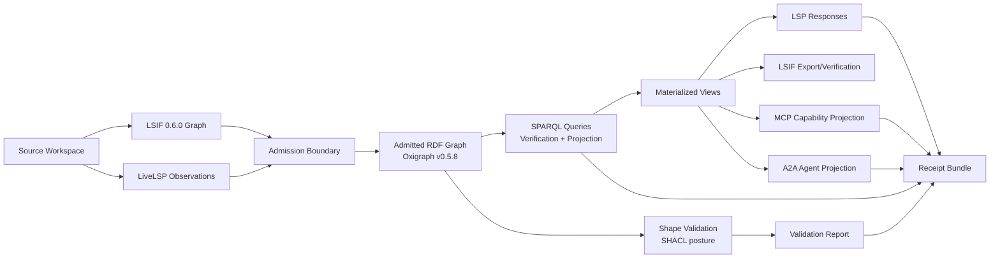
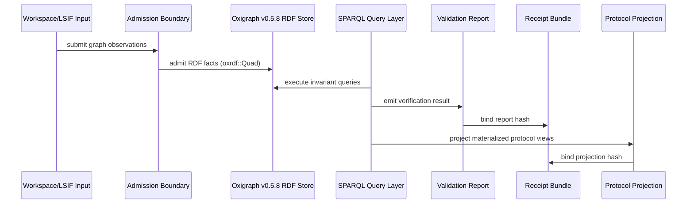
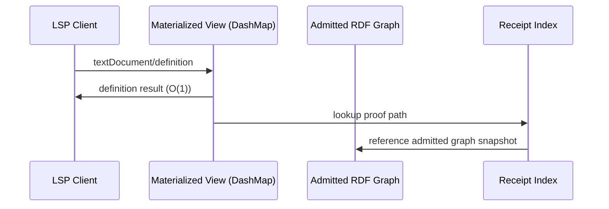
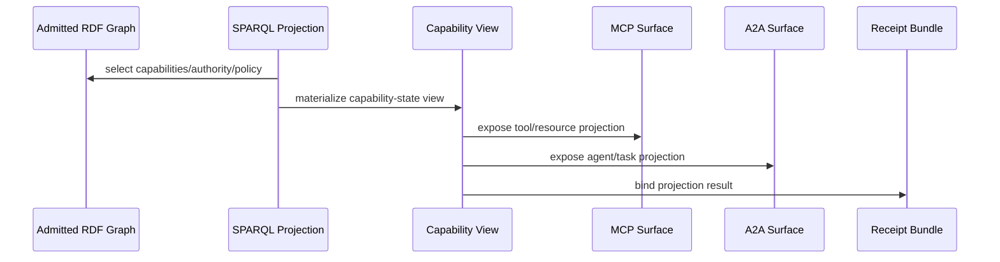

# PRD/ARD: tower-lsp-max v26.6.5 with Oxigraph/SPARQL

## Title

**tower-lsp-max v26.6.5: Oxigraph/SPARQL Admitted Graph Control Plane**

## Release Classification

```text
Status: PARTIAL_ALIVE → ALIVE candidate
Release: v26.6.5
Primary shift: LSIF core + RDF/SPARQL control plane
Strategic frame: LSP → LSIF → LiveLSP → MCP/A2A capability-state graph
```

---

# 1. Product Requirements Document

## 1.1 Product Thesis

tower-lsp-max v26.6.5 introduces an **Oxigraph/SPARQL-backed admitted graph control plane** that elevates LSIF, diagnostics, lifecycle state, receipts, and future MCP/A2A capability-state projections into a mathematically queryable, verifiable, and deterministically replayable ontology.

The v26.6.4 release proved that LSIF 0.6.0 is not merely an auxiliary export format, but the true static artifact of semantic intelligence. By introducing strictly typed `ItemEdgeProperty` definitions, streaming `LsifReader` paradigms, and safe combinatorial binders, we established a mathematically sound topological framework backed by a green receipt of 403 passing tests. 

The evolutionary product leap in v26.6.5 is epistemological:

```text
LSIF answers "what" the language server knows.
Oxigraph/SPARQL answers "why" the knowledge is lawful and "who" generated it.
```

Oxigraph v0.5.8 provides a high-performance, Rust-native RDF graph database, leveraging RocksDB for resilient on-disk storage and fully implementing the W3C SPARQL 1.1 (and experimental 1.2) query engine. LSIF's core objective—to decouple editor interactions from synchronous, compute-bound language server invocations—is fundamentally incomplete if the generated graph cannot be queried, constrained, and audited by autonomous agents. The integration of Oxigraph fulfills this mandate, transforming a static file format into a live, receipt-bound semantic control plane.

---

## 1.2 Customer Problem: The Crisis of Dynamic Epistemology

Current Language Server Protocol (LSP) infrastructure is hopelessly bound to the synchronous human-cognitive loop. It answers ephemeral, request-time questions (`textDocument/hover`, `textDocument/definition`, `textDocument/codeAction`).

While sufficient for human engineers operating within a single buffer, this dynamic epistemology collapses under the weight of autonomous system demands. Agents, Continuous Integration pipelines, and security auditors require answers to fundamentally different classes of inquiries:

```text
What specific graph state was formally admitted at transaction N?
Which precise LSIF edge provides the deterministic proof for this capability?
Which internal diagnostic rule triggered this specific code action?
Which source observation (URI/Version) generated this specific semantic artifact?
Which exact capability is an MCP/A2A actor authorized to invoke?
Where is the cryptographic receipt proving this consequence?
Can a secondary, air-gapped verifier replay this exact same result?
```

Without an admitted graph control plane, `tower-lsp-max` remains trapped in the paradigm of a high-performance reactive tool, rather than ascending to its intended destiny as the **protocol-native intelligence substrate**.

---

## 1.3 Product Goal

Establish a product-level capability titled:

```text
Admitted Graph Control Plane
```

Its systemic role guarantees unidirectional flow and absolute provenance:

```text
source / LSIF / diagnostics / protocol state / receipts
  ↓ 
admitted RDF graph (oxrdf::Quad)
  ↓ 
SPARQL verifier/projection queries
  ↓ 
materialized language/capability indexes (HashMaps/DashMaps)
  ↓ 
LSP / LSIF / MCP / A2A surfaces
  ↓ 
receipts and cryptographic replay
```

---

## 1.4 Target Users & Combinatorial Value Delivery

| User | Combinatorial Need | Value Realization |
| :--- | :--- | :--- |
| **LSP Framework Author** | Verify language-intelligence graph structure mathematically before exposing it to clients. | Executing a SPARQL `ASK` query to definitively prove zero LSIF edge orphans exist. |
| **Static-Analysis Builder** | Query and validate cross-file and cross-symbol relationships recursively. | Utilizing SPARQL path traversal (`*` or `+`) over `lsif:next` and `lsif:item` edges. |
| **Agent Infrastructure Builder** | Discover capabilities, bounded authorities, explicit side effects, and verified repair routes. | Extracting MCP tool definitions backed by `prov:wasGeneratedBy` receipts. |
| **Verifier / Auditor** | Re-run exact graph queries against frozen graph states and compare cryptographic receipts. | Replay determinism; preventing "ontology laundering" or post-hoc graph manipulation. |
| **Protocol Designer** | Project a singular admitted truth state into divergent LSP, LSIF, MCP, and A2A API surfaces. | A single `oxigraph::Store` generating diverse, materialized JSON-RPC response views. |
| **Future Coding Agent** | Consume bounded, pre-verified graph answers rather than hallucinating against raw ASTs. | Interfacing with the `max:` namespace via structured SPARQL rather than unstructured text. |

---

## 1.5 Core User Stories: The Control Plane in Action

### Story 1 — Verify LSIF graph structure
**As a verifier**, I want to load LSIF-derived graph facts into an admitted RDF store so that I can query whether all graph edges, ranges, result sets, and semantic relations are structurally lawful.
**Receipt condition:** Every verification result must be cryptographically bound to the graph input hash (`GraphName`), the query identity, the result hash, and the execution timestamp.

### Story 2 — Explain diagnostics through graph evidence
**As an LSP consumer**, I want diagnostics to reference explicit graph evidence, exact rule identity, and a deterministic repair route so that a diagnostic is not merely a transient string message, but a traceable, admitted state transition inside the autonomic mesh.

### Story 3 — Project admitted state into multiple protocols
**As a protocol integrator**, I want the identical admitted graph state to support synchronous LSP responses, static LSIF chunk exports, MCP capability surfaces, and A2A capability/task metadata seamlessly.
*Context:* The Model Context Protocol (MCP) standardizes LLM access to external tools, while A2A formalizes multi-agent coordination. The graph must act as the unified data substrate for all endpoints.

### Story 4 — Replay a graph consequence
**As an auditor**, I want to replay a specific SPARQL query against the identical admitted graph hash (`GraphName`) and retrieve the exact same result hash. This proves irrefutably that the prior LSP/LSIF/MCP/A2A consequence was derived deterministically and not hallucinated or altered after the fact.

---

## 1.6 Product Requirements

### PRD-R1 — Admitted RDF Graph State
`tower-lsp-max` v26.6.5 shall instantiate an admitted graph state representing the entire combinatorial space:
```text
workspace, document, range, symbol, LSIF vertex, LSIF edge, diagnostic, rule, query, artifact, receipt, protocol capability, agent/tool/resource projection
```
*Crucial Architecture Note:* This graph state is strictly the **control plane**. It does not block the hot-path execution kernel.

### PRD-R2 — SPARQL Verification Queries
The system shall provide embedded SPARQL 1.1/1.2 queries targeting strict invariants:
```text
- ∀ e ∈ LSIF_Edges: ∃ v ∈ LSIF_Vertices | e.target == v (No orphans).
- ∀ r ∈ Ranges: ∃ d ∈ Documents | r.belongs_to == d.
- ∀ diag ∈ Diagnostics: ∃ rule ∈ Rules | diag.conformsTo == rule.
- ∀ a ∈ Artifacts: ∃ rcpt ∈ Receipts | a.wasGeneratedBy == rcpt.
- ∀ cp ∈ Capabilities: ∃ auth ∈ Authorities ∧ ∃ se ∈ SideEffects.
```

### PRD-R3 — SHACL-Compatible Validation Posture
Graph-shape validation shall be cleanly bifurcated from query projection utilizing the W3C Shapes Constraint Language (SHACL) paradigm:
```text
SPARQL = Epistemological Query / Projection / Explanation
SHACL  = Structural Constraint Validation / Shape Verification
LSIF   = Static Language-Server Result Substrate
LSP    = Interactive Client/Server Transport Surface
```

### PRD-R4 — LSIF Remains the Static LSP Answer Format
Oxigraph/RDF strictly does **not** deprecate LSIF.
LSIF remains the standards-aligned static code-intelligence artifact. RDF/SPARQL operates orthogonally to verify, enrich, cross-link, and project the LSIF structure.
```text
LSIF answers language-server (developer) questions.
RDF/SPARQL answers graph-law (agent/auditor) questions.
Receipts answer cryptographic proof questions.
```

### PRD-R5 — Materialized Response Views
The system shall explicitly forbid executing arbitrary SPARQL against the `oxigraph::Store` during a live `textDocument/definition` hot-path request.
Instead, SPARQL is executed asynchronously to verify and project the admitted graph state into **Materialized Views** (e.g., `dashmap::DashMap`). These views answer latency-sensitive LSP requests `O(1)`.

### PRD-R6 — Receipt Binding
Every admitted consequence must be bound by a cryptographic `max:Receipt` defining the Merkle-DAG provenance:
```text
[input graph hash] + [query identity/hash] + [query parameters] → [result hash]
↳ binds to: [projection target], [diagnostic/artifact identity], [timestamp/version]
```

### PRD-R7 — Protocol Projection Readiness
The graph control plane must formulate a schema to project into:
`LSP, LSIF, MCP, A2A, Process Evidence (OCEL), Verifier Reports`
*Note:* Alignment with Microsoft’s Base Protocol 0.9 is treated as a tracked target rather than stable law due to its experimental status.

---

## 1.7 Non-Goals: Guarding the Architectural Sovereignty

| Non-goal | Architectural Rationale |
| :--- | :--- |
| **Replace LSIF** | LSIF is the universally recognized static language-intelligence artifact; RDF cannot replace its ecosystem tooling. |
| **Replace LSP** | LSP remains the de facto editor/client protocol surface. |
| **Run SPARQL on every keystroke** | Introduces catastrophic hot-path risk and violates the decoupled control plane mandate. |
| **Invent private ontology as foundation** | Public vocabularies (`prov:`, `sh:`, `lsif:`) carry shared mathematical meaning. Private ontologies dilute interoperability. |
| **Turn Oxigraph into the execution kernel** | Oxigraph is the *graph control plane*, not the execution or JSON-RPC router. |
| **Treat RDF as source truth** | RDF merely stores the *admitted state* derived from raw reality, not the raw reality itself. |
| **Claim ALIVE without replay** | A False ALIVE violates the fundamental doctrine of cryptographic receipt validation. |

---

## 1.8 Success Metrics

| Metric | Target |
| :--- | :--- |
| LSIF graph facts admitted into `oxigraph::Store` | 100% for supported fixture surface |
| SPARQL invariant suite pass rate | 100% |
| Replay determinism | same graph hash + same query hash → same result hash |
| Interactive LSP hot-path regression | None admitted |
| Receipt coverage for graph projections | 100% for emitted diagnostics/artifacts |
| Invalid graph fixture detection | 100% for defined negative fixtures |
| Graph validation report | Emitted as first-class `VerificationReport` artifact |
| Workspace test health | No regression from v26.6.5 LSIF baseline (404 tests) |

---

## 1.9 Release Acceptance Gates

```text
PARTIAL_ALIVE:
  Oxigraph v0.5.8 / SPARQL 1.1 graph control plane is specified.
  Graph vocabulary boundary (Namespace Matrix) is documented.
  LSIF-to-graph admission model (`oxrdf::Quad` conversion) is defined.
  Verification query classes (SPARQL strings) are enumerated.

ALIVE:
  A fixture workspace successfully produces:
    - Admitted `oxrdf` graph state in `oxigraph::Store`.
    - SPARQL verification report.
    - LSIF structural validation result.
    - Diagnostic explanation.
    - Cryptographic receipt bundle.
    - Deterministic, replay-equivalent result.

BLOCKED:
  License leakage, invalid dependencies (e.g. oxigraph v0.3.x), hot-path performance regression, or ontology-boundary corruption prevents safe admission.

BUILD_BROKEN:
  Existing v26.6.5 LSIF/test baseline regresses.

UNSUPPORTED:
  Claims about MCP/A2A production interoperability before the actual projection API surfaces exist.
```

---

# 2. Architecture Requirements Document

## 2.1 Architecture Decision
**Decision:** `tower-lsp-max` v26.6.5 implements an **Oxigraph v0.5.8/SPARQL-backed admitted graph control plane** strictly partitioned behind the LSIF/LSP routing surfaces.

**Not Decision:** Oxigraph is absolutely not the interactive request hot path. SPARQL does not deprecate typed Rust structures, LSIF DOMs, or `DashMap` materialized indexes.

## 2.2 Architectural Context
The framework is executing a combinatorial pivot from request-time JIT computation toward static, AOT graph intelligence. By enforcing strict LSIF item-edge typing and streaming LSIF emission, the structural foundation is set. This ARD defines the integration of `oxigraph` to supply the missing graph query law, providing an autonomic mesh that routes admitted typestates into cryptographic receipts and persistent RocksDB graph storage.

## 2.3 Architecture Principles
```text
1. LSIF is the static LSP artifact.
2. RDF is the admitted graph-state substrate.
3. SPARQL is the verifier/projection language.
4. Materialized views serve hot-path LSP responses.
5. Receipts bind graph consequences.
6. Public vocabularies carry shared meaning.
7. Private project vocabulary is bounded and projected, not foundational.
8. No false ALIVE.
```

---

## 2.4 System Context Diagram (Combinatorial Control Plane)



---

## 2.5 Logical Architecture & Data Flow

### A. Observation Layer
Funneled through `SourceObservation` abstractions. Admits observations from the source workspace, LSIF dumps, diagnostic emissions, capability declarations, and receipt events.
*Output:* Candidate graph facts.

### B. Admission Layer
Determines graph fact lifecycle routing via the `RelationAdmitter` trait.
*States:* `RAW`, `CANDIDATE`, `ADMITTED`, `REFUSED`, `QUARANTINED`, `SUPERSEDED`, `REPLAYED`.

### C. RDF Graph Store (`oxigraph::Store`)
Oxigraph v0.5.8 provides an embedded, RocksDB-backed RDF dataset.
*Responsibilities:* 
- Store admitted facts as `oxrdf::Quad`s.
- Isolate graph snapshots cryptographically via `GraphName` boundaries.
- Support multi-threaded SPARQL execution via `SparqlEvaluator`.
- Support strict replay against frozen graph states.

### D. SPARQL Query Layer
*Query Classes:*
- **Structural Invariants:** Validates LSIF edge/vertex/range legality.
- **Provenance Invariants:** Ensures every node tracks to a source/query/receipt chain.
- **Diagnostic Queries:** Explains the rule derivation of a diagnostic.
- **Projection Queries:** Constructs materialized protocol-specific views.
- **Capability Queries:** Maps tools/agents/resources.
- **Replay Queries:** Deterministically reproduce prior result hashes.

### E. Shape Validation Layer
*SHACL Posture:*
- RDF data graph = admitted `tower-lsp-max` state.
- SHACL shapes graph = topological constraints.
- Output = Diagnosable validation report artifact.

### F. Materialized View Layer
Crucial for fulfilling Invariant 3 (No hot-path SPARQL dependency).
SPARQL projections pre-calculate and populate `DashMap` or equivalent in-memory lookup tables for: `definition`, `reference`, `hover`, `diagnostic`, and `receipt-index` views.

### G. Protocol Projection Layer
Formats materialized views into standardized protocol responses targeting: LSP, LSIF NDJSON, MCP, A2A, Verifier Reports, and OCEL Process Evidence.

---

## 2.6 Data Model Boundary: The Anti-Laundering Doctrine

### Public Vocabulary First
We rely exclusively on standardized W3C and Microsoft semantics to ensure universal downstream interoperability:
```text
PROV-O      provenance
DCTERMS     documents/resources
DCAT        catalogs/datasets
SKOS        concept schemes
SHACL       validation constraints
ODRL        permissions/policy
RDF/RDFS    graph/model foundation
LSIF        language-index projection
OCEL        object-centric process evidence
```

### Bounded Private Vocabulary
The `max:` and `rcpt:` prefixes are strictly bounded and utilized *only* where stable public vocabulary coverage does not exist:
```text
LiveLSP diagnostic lifecycle
residual-clear state
max protocol receipt event
LSIF-specific projection handle
admission/refusal checkpoint state
```
*Law:* Public ontology first. Private projection vocabulary second. No private mythology as foundation.

---

## 2.7 Required Graph Object Classes
```text
Workspace, Document, Range, Symbol, ResultSet, DefinitionResult, ReferenceResult, HoverResult, Diagnostic, Rule, Query, Shape, Artifact, Receipt, Capability, Authority, Policy, Agent, Tool, Task, Projection, Replay
```

## 2.8 Required Graph Relations
```text
document contains range, range denotes symbol, symbol has definition, symbol has reference, result wasGeneratedBy query, diagnostic conformsTo rule, artifact wasDerivedFrom source, receipt proves artifact, capability requires authority, tool has input schema, tool has side-effect class, agent declares capability, task produces artifact, projection targets protocol
```

---

## 2.9 Core Invariants & SPARQL Definitions

### Invariant 1 — No orphan LSIF relations
Every admitted LSIF edge must resolve to admitted source and target graph objects.
```sparql
PREFIX lsif: <https://microsoft.github.io/language-server-protocol/specifications/lsif/0.6.0/specification/>
ASK {
  ?s ?p ?o .
  FILTER(STRSTARTS(STR(?p), STR(lsif:)))
  FILTER NOT EXISTS { ?o ?any_p ?any_o }
} # Must evaluate to False
```

### Invariant 2 — No unreceipted graph consequence
Every emitted diagnostic, projection, validation report, or protocol artifact must have a receipt path.
```sparql
PREFIX prov: <http://www.w3.org/ns/prov#>
PREFIX max: <urn:tower-lsp-max:core:>
ASK {
  ?artifact a max:Artifact .
  FILTER NOT EXISTS { ?artifact prov:wasGeneratedBy ?receipt }
} # Must evaluate to False
```

### Invariant 3 — No hot-path SPARQL dependency
Interactive LSP requests must be answerable from materialized views (`DashMap` queries), bypassing the `oxigraph::Store` execution engine completely.

### Invariant 4 — No ontology laundering
A private term (`max:MyCustomEdge`) cannot masquerade as public semantic authority (e.g., must not be serialized as an `lsif:` entity).

### Invariant 5 — No false ALIVE
ALIVE status requires cryptographic replay determinism, not merely a successful process exit code.

---

## 2.10 Architecture Sequence: Verification Flow



## 2.11 Architecture Sequence: LSP Response Flow (Hot-Path)



## 2.12 Architecture Sequence: MCP/A2A Projection Flow



---

## 2.13 Decision Records

### ARD-001 — Use Oxigraph v0.5.8 as Embedded RDF Store
**Decision:** Use `oxigraph` v0.5.8 as the local admitted RDF graph store.
**Rationale:** Oxigraph is a high-performance, Rust-native graph database. Version 0.5.8 implements modern SPARQL 1.1 (and experimental 1.2 via `rdf-12`), utilizes RocksDB for persistent on-disk topologies, and aligns perfectly with `tower-lsp-max`’s zero-cost abstraction philosophy.
**Consequence:** Query evaluation compute cost must be strictly absorbed during the AOT indexing phase, populating the materialized views.

### ARD-002 — Use SPARQL as Query/Projection Language
**Decision:** Use SPARQL for graph verification, explanation, and projection.
**Rationale:** SPARQL is the unassailable W3C standard for interrogating RDF topologies.
**Consequence:** Every SPARQL query string executed by the system forms a discrete computational transaction that must be cryptographically hashed and receipted.

### ARD-003 — Preserve LSIF as Static Language-Intelligence Artifact
**Decision:** LSIF 0.6.0 remains the canonical static LSP artifact.
**Rationale:** LSIF serves the specific domain of code editor intelligence perfectly. Oxigraph is not replacing it; it is elevating it by acting as the validation and provenance wrapper.
**Consequence:** RDF/SPARQL verifies LSIF, it does not overwrite the LSIF specification.

### ARD-004 — Use Materialized Views for Latency-Sensitive Responses
**Decision:** LSP client responses resolve from in-memory views, not active SPARQL evaluation.
**Rationale:** Human cognitive loops demand `<50ms` latency. SPARQL execution across terabyte-scale graphs violates this constraint.
**Consequence:** The architecture enforces a strict read-replica separation pattern.

### ARD-005 — Support Future MCP/A2A Projections
**Decision:** The graph model structurally provisions capability-state projection for MCP and A2A integration.
**Rationale:** Next-generation autonomous agents rely on standardized tool schemas (MCP) and multi-agent task delegation (A2A).
**Consequence:** We mark projection readiness without making premature assertions of production support before the surfaces are finalized.

---

## 2.14 Verification Ladder

```text
Unit:
  RDF term mapping (`oxrdf::NamedNode`) validates for each supported LSIF graph object.

Integration:
  LSIF test fixture admits flawlessly into an in-memory `oxigraph::Store` and passes all SPARQL invariant queries.

E2E:
  Fixture workspace produces an exact LSP/LSIF response view accompanied by an immutable cryptographic receipt bundle.

Chaos:
  Invalid LSIF topologies (e.g., missing targets, malformed `max:severity` states, unlinked provenance) are aggressively caught and `REFUSED`.

Stress:
  Large LSIF NDJSON streams buffer into the RDF store without triggering memory exhaustion (DOM bloat).

Benchmark:
  LSP materialized view lookup latency guarantees zero regression against the prior v26.6.5 LSIF static baseline.

Verifier report:
  Executing the identical SPARQL query against the identical `GraphName` hash deterministically yields the exact same cryptographic result hash.
```

---

## 2.15 Risk Register

| Risk | Severity | Mitigation |
| :--- | :--- | :--- |
| **SPARQL becomes hot-path bottleneck** | High | Hard architectural boundary: `oxigraph` updates *Materialized Views* asynchronously; the LSP router queries the views only. |
| **RDF model becomes private ontology soup** | High | Unyielding enforcement of `prov:`, `lsif:`, and `sh:` vocabularies over `max:` custom namespaces. |
| **LSIF and RDF drift apart** | High | Continuous integration testing binding LSIF import/export streams directly against the SPARQL structural invariant queries. |
| **Oxigraph performance assumptions fail** | Medium | Isolate Oxigraph usage strictly to the Control Plane. Implement comprehensive RocksDB persistence benchmarks before global enablement. |
| **SHACL / SPARQL responsibility confusion** | Medium | SHACL validates the topology. SPARQL explores and projects it. |
| **MCP/A2A overclaim** | Medium | Clearly delineate between "projection readiness" in the RDF graph vs. fully implemented network transport servers. |
| **False ALIVE** | Critical | Promotion requires a 100% successful replay-equivalent verifier report. |

---

# 3. Release Gate

## v26.6.5 with Oxigraph/SPARQL is ALIVE only when:

```text
Given a fixture workspace and LSIF graph:

1. The LSIF graph is admitted into the `oxigraph::Store` RDF graph state.
2. SPARQL invariant queries validate the structural and provenance laws.
3. Invalid graph fixtures are explicitly refused with detailed diagnostics.
4. A materialized LSP view efficiently answers at least one core relational query (e.g., Definition).
5. A `VerificationReport` is successfully emitted.
6. A receipt bundle securely binds the input graph, query identity, result, projection, and artifact.
7. Replay against the same graph/query hashes reproduces the identical result hash.
8. The existing v26.6.5 LSIF baseline remains unconditionally green.
```

Until all conditions are met:
```text
Status = PARTIAL_ALIVE
```

---

# 4. Final Product Sentence

**tower-lsp-max v26.6.5 with Oxigraph v0.5.8 and SPARQL 1.1/1.2 turns LSIF from a static language-index artifact into a mathematically admitted, queryable, verifiable, and receipt-bearing graph control plane, establishing the definitive substrate for synchronous LSP interactions today and autonomous MCP/A2A capability-state intelligence tomorrow.**