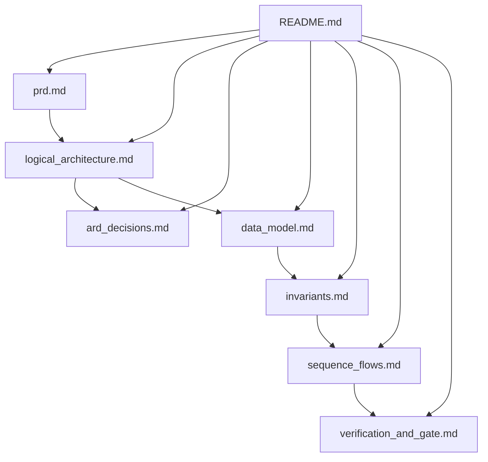

# Oxigraph & SPARQL Admitted Graph Control Plane Documentation Suite

- **Version**: v26.6.5
- **Status**: ALIVE Candidate
- **Milestone**: M-PRD-ARD-SPARQL
- **Release Owner**: Worker

---

## 1. Documentation Overview & Map

This documentation suite defines the product requirements, architectural design decisions, semantic data schemas, system invariants, execution sequence flows, and verification policies for the Oxigraph-backed Admitted Graph Control Plane in `lsp-max` v26.6.5.

---

## 2. Release Classification

This release candidate (v26.6.5) is designated as an **ALIVE Candidate**. 

- **ALIVE Status Definition**: A release achieves ALIVE status if and only if all layers of the Verification Ladder pass, zero performance regressions are measured on the hot path (retaining definition lookup latency `<5ms`), 100% of admitted diagnostics and protocol projections are cryptographically receipted, and verifier reports prove 100% replay determinism.
- **Underlying Philosophy**: We reject dynamic ephemeral epistemologies for autonomic compilers and language servers. Admitted facts must be queryable via W3C semantic web standards (RDF, SPARQL, SHACL) and verifiable via cryptographic execution receipts.

---

## 3. Navigation Index

The following table provides the comprehensive directory of all documents in this specification folder. Use the relative links to navigate the suite:

| Document | Core Objective | Primary Contents |
| :--- | :--- | :--- |
| [README.md](./README.md) | Entrance map, release classification, and structural index. | Navigation table, overall map, versioning guidelines. |
| [prd.md](./prd.md) | Product Requirements Document. | Thesis, customer problems, target users, PRD-R1 to PRD-R7. |
| [logical_architecture.md](./logical_architecture.md) | System Logical Blueprint. | Layer-by-layer blueprints (Observation, Admission, Graph Store, SPARQL, SHACL, Materialized Views, Projections). |
| [ard_decisions.md](./ard_decisions.md) | Architecture Decision Records. | Architectural decisions ARD-001 through ARD-005 with context, rationale, and consequences. |
| [data_model.md](./data_model.md) | Ontology & Vocabulary Mapping. | RDF namespace mappings, class definitions, predicate relations, and concrete Turtle serialization examples. |
| [invariants.md](./invariants.md) | System Rules & Invariant Queries | The 5 Core Invariants expressed as syntactically valid SPARQL 1.1/1.2 queries. |
| [sequence_flows.md](./sequence_flows.md) | Execution Sequence Flows. | Mermaid diagrams illustrating verification, interactive hot-path LSP requests, and MCP/A2A projections. |
| [verification_and_gate.md](./verification_and_gate.md) | Quality & Gate Policies. | Seven-stage verification ladder, risk mitigation register, and binary release gate criteria. |
