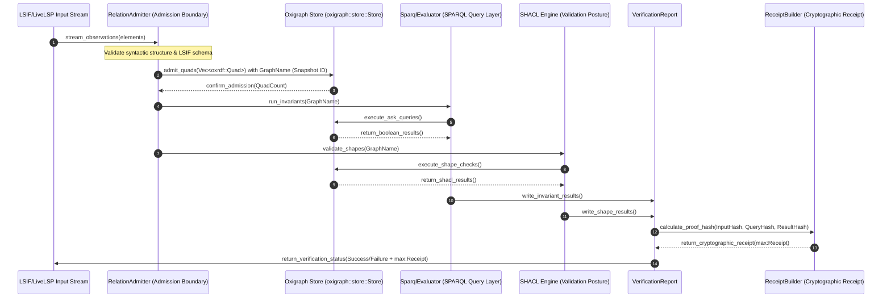
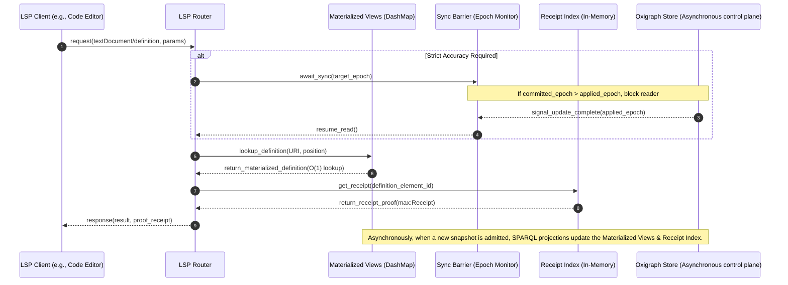
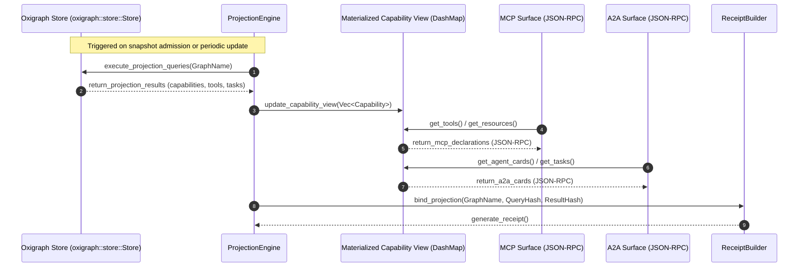

# Execution Sequence Flows: lsp-max v26.6.5

This document maps the runtime interactions and transaction pathways of the Admitted Graph Control Plane using Mermaid diagrams.

---

## 1. Verification Flow

This sequence diagram illustrates the pipeline from LSIF ingestion through syntactic checking, SPARQL invariant validation, SHACL shapes checking, and receipt generation.

---

## 2. LSP Response Flow (Hot-Path)

To maintain a definition lookup latency under `<5ms`, client requests are served from in-memory materialized views. These views are asynchronously synchronized with the persistent Oxigraph store when snapshots change. If strict accuracy is required, a synchronization barrier blocks the reader until the views catch up with the committed transaction epoch.

---

## 3. MCP/A2A Projection Flow

This diagram shows how the control plane projects its graph state to the Model Context Protocol (MCP) and Agent-to-Agent (A2A) protocol interfaces, providing agents with verifiable capabilities.

